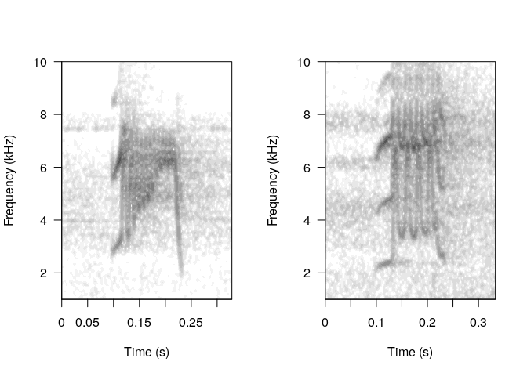
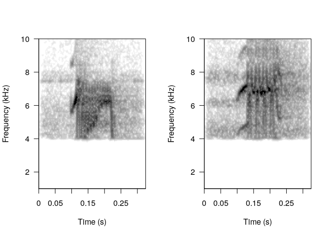
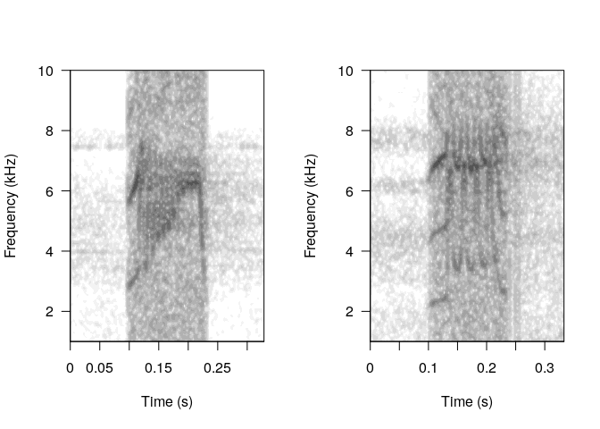

> > "Is there a simple way to remove noise from the clips in an extended table -- I can do this by directly manipulating the attributes of the table but it seems a bit kludgy ... so again, am I missing something simple?"

Manipulating clips from *extended selection tables* is pretty straightforward. This can be done using `lapply()` to go over each clip. Things should be fine as long as you don't modify any time related feature. For example filtering out low frequencies on the clips from the example *extended selection table* 'lbh.est' from the package [NatureSounds](https://marce10.github.io/NatureSounds). This is how the original clips look like:

``` r
# load packages
library(NatureSounds)
library(warbleR)
library(seewave)

# load data
data("lbh.est")

# extract 2 clips
w1 <- read_wave(lbh.est, 12, from = 0, to = Inf)
w2 <- read_wave(lbh.est, 20, from = 0, to = Inf)

# split graphic device
par(mfrow = c(1, 2))

# plot spectros
spectro(w1, wl = 300, ovlp = 95, flim = c(1, 10), scale = FALSE, 
        grid = FALSE, palette = reverse.gray.colors.1, 
        collevels = seq(-70, 0, 5))

spectro(w2, wl = 300, ovlp = 95, flim = c(1, 10), scale = FALSE, 
        grid = FALSE, palette = reverse.gray.colors.1, 
        collevels = seq(-70, 0, 5))
```



Clips are stored in an attribute call 'wave.objects'. In this particular example the list of clips can be called like this: `attributes(lbh.est)$wave.objects`

We can apply a bandpass filter from 4 to 10 kHz over each element of this list using `lapply()` and `ffilter()` (from [seewave](http://rug.mnhn.fr/seewave)):

``` r
# filter out freqs below 4 kHz
attributes(lbh.est)$wave.objects <- lapply(attributes(lbh.est)$wave.objects, 
    FUN = ffilter, from = 4000, to = 10000, output = "Wave")
```

We can double-check that the bandpass has been succesfully applied look again at the spectrograms:

``` r
# extract the same 2 clips again
w1 <- read_wave(lbh.est, 12, from = 0, to = Inf)
w2 <- read_wave(lbh.est, 20, from = 0, to = Inf)

# split graphic device
par(mfrow = c(1, 2))

# plot spectros
spectro(w1, wl = 300, ovlp = 95, flim = c(1, 10), scale = FALSE, 
        grid = FALSE, palette = reverse.gray.colors.1, 
        collevels = seq(-70, 0, 5))

spectro(w2, wl = 300, ovlp = 95, flim = c(1, 10), scale = FALSE, 
        grid = FALSE, palette = reverse.gray.colors.1, 
        collevels = seq(-70, 0, 5))
```



``` r
# load data
data("lbh.est")

# filter out freqs below 4 kHz
attributes(lbh.est)$wave.objects <- lapply(attributes(lbh.est)$wave.objects, 
    FUN = afilter, threshold = 40, output = "Wave", plot = FALSE)


# extract the same 2 clips again
w1 <- read_wave(lbh.est, 12, from = 0, to = Inf)
w2 <- read_wave(lbh.est, 20, from = 0, to = Inf)

# split graphic device
par(mfrow = c(1, 2))

# plot spectros
spectro(w1, wl = 300, ovlp = 95, flim = c(1, 10), scale = FALSE, 
        grid = FALSE, palette = reverse.gray.colors.1, 
        collevels = seq(-70, 0, 5))

spectro(w2, wl = 300, ovlp = 95, flim = c(1, 10), scale = FALSE, 
        grid = FALSE, palette = reverse.gray.colors.1, 
        collevels = seq(-70, 0, 5))
```


----------------------------------------------------------------------------------------------------------------------------------

<font size="4">Session information</font>

    ## R version 3.6.1 (2019-07-05)
    ## Platform: x86_64-pc-linux-gnu (64-bit)
    ## Running under: Ubuntu 18.04.4 LTS
    ## 
    ## Matrix products: default
    ## BLAS:   /usr/lib/x86_64-linux-gnu/atlas/libblas.so.3.10.3
    ## LAPACK: /usr/lib/x86_64-linux-gnu/atlas/liblapack.so.3.10.3
    ## 
    ## locale:
    ##  [1] LC_CTYPE=es_ES.UTF-8       LC_NUMERIC=C              
    ##  [3] LC_TIME=es_CR.UTF-8        LC_COLLATE=es_ES.UTF-8    
    ##  [5] LC_MONETARY=es_CR.UTF-8    LC_MESSAGES=es_ES.UTF-8   
    ##  [7] LC_PAPER=es_CR.UTF-8       LC_NAME=C                 
    ##  [9] LC_ADDRESS=C               LC_TELEPHONE=C            
    ## [11] LC_MEASUREMENT=es_CR.UTF-8 LC_IDENTIFICATION=C       
    ## 
    ## attached base packages:
    ## [1] stats     graphics  grDevices utils     datasets  methods   base     
    ## 
    ## other attached packages:
    ## [1] warbleR_1.1.24     seewave_2.1.5      tuneR_1.3.3        NatureSounds_1.0.3
    ## [5] knitr_1.28        
    ## 
    ## loaded via a namespace (and not attached):
    ##  [1] Rcpp_1.0.4.6    dtw_1.21-3      fftw_1.0-6      digest_0.6.25  
    ##  [5] bitops_1.0-6    MASS_7.3-51.4   signal_0.7-6    magrittr_1.5   
    ##  [9] evaluate_0.14   pbapply_1.4-2   rlang_0.4.6     stringi_1.4.6  
    ## [13] rmarkdown_1.17  rjson_0.2.20    tools_3.6.1     stringr_1.4.0  
    ## [17] RCurl_1.98-1.2  proxy_0.4-24    parallel_3.6.1  xfun_0.13      
    ## [21] yaml_2.2.1      compiler_3.6.1  htmltools_0.4.0
